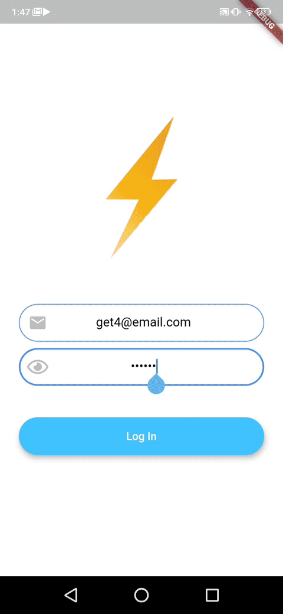

# Flash Chat ⚡️

Flash Chat Project from the Complete Flutter Development Bootcamp https://www.appbrewery.co, with added features.

Chat application using Firebase's Cloud Firestore database.

## Customization

The following is my implementation.

- Implemented group chat
- Implemented user selection screen
- Implemented 'recent message' in chat list screen
- Implemented groupnames

## Packages used
- [intl](https://pub.dev/packages/intl)
- [font_awesome_flutter](https://pub.dev/packages/font_awesome_flutter)
- [animated_text_kit](https://pub.dev/packages/animated_text_kit)
- [firebase_core](https://pub.dev/packages/firebase_core)
- [firebase_auth](https://pub.dev/packages/firebase_auth)
- [cloud_firestore](https://pub.dev/packages/cloud_firestore)
- [modal_progress_hud](https://pub.dev/packages/modal_progress_hud)
- [shared_preferences](https://pub.dev/packages/shared_preferences)
